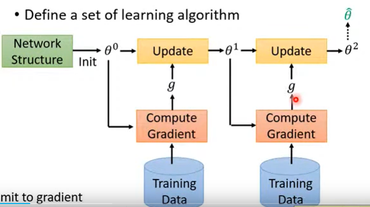
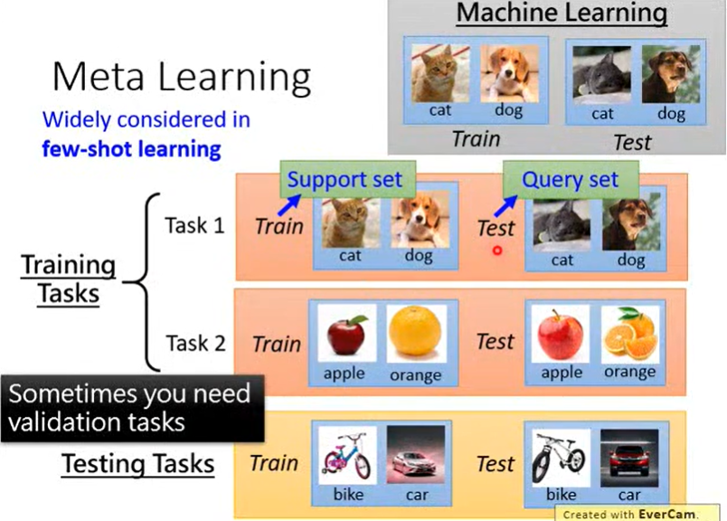
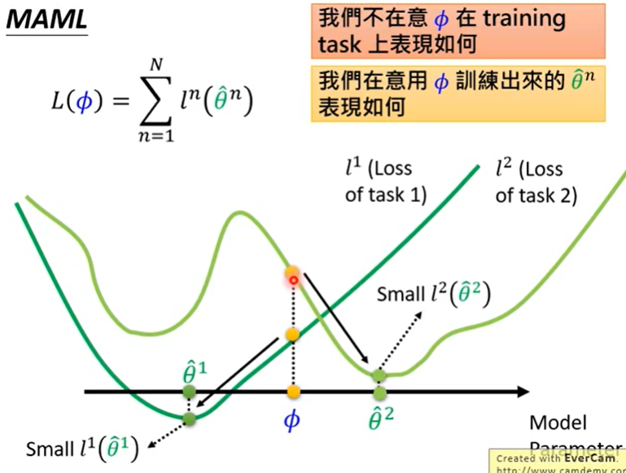
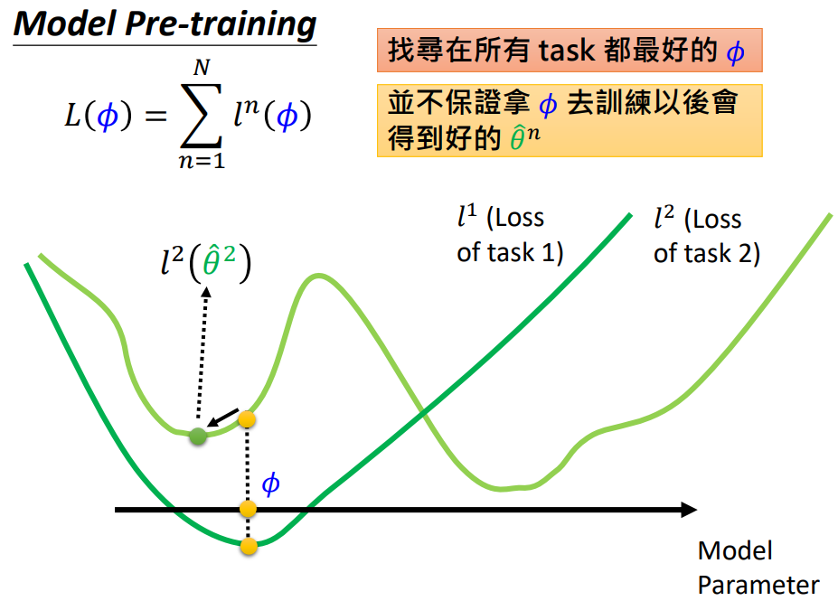

# Model-Agnostic Meta-Learning for Fast Adaptation of Deep Networks

- Paper Link: [arXiv](https://arxiv.org/pdf/1703.03400.pdf)
- Author's code: [https://github.com/VeritasYin/STGCN_IJCAI-18](https://github.com/VeritasYin/STGCN_IJCAI-18)
- reference blogs:
    - [Paper repro: Deep Metalearning using “MAML” and “Reptile”](https://towardsdatascience.com/paper-repro-deep-metalearning-using-maml-and-reptile-fd1df1cc81b0)
      - [Blog Github code](https://github.com/AdrienLE/ANIML/blob/master/ANIML.ipynb)
- reference lecture:
  - [taiWan: ML_2019/Lecture/MetaLearning](https://speech.ee.ntu.edu.tw/~tlkagk/courses/ML_2019/Lecture/Meta1%20(v6).pdf)
    - text url: https://speech.ee.ntu.edu.tw/~tlkagk/courses/ML_2019/Lecture/Meta1%20(v6).pdf

## Basic Knowlegde

**What is Meta Learning?**

- train a series of similar tasks, get an algorithm which can product a task-solver-function with few data of the new task.

**What's the differents between Machine Learning and Meta Learning?**

**What's the differents between Pre-training and Meta Learning?**

## Summary

The paper presents a model-agnostic meta-learning algorithm for fast adaptation of deep networks. The goal of meta-learning is to train a model on a variety of learning tasks so that it can solve new tasks using only a small number of training samples. The proposed algorithm explicitly trains the model's parameters to be easily fine-tuned, allowing for fast adaptation. The algorithm is compatible with any model trained with gradient descent and applicable to various learning problems, including classification, regression, and reinforcement learning. The document demonstrates that the algorithm achieves **state-of-the-art performance on few-shot image classification benchmarks**, produces good results on few-shot regression, and accelerates fine-tuning for policy gradient reinforcement learning. 

Main points:

- Meta-learning algorithm for fast adaptation of deep networks
- Model-agnostic and compatible with any model trained with gradient descent
- Applicable to various learning problems, including classification, regression, and reinforcement learning
- **Trains model parameters to be easily fine-tuned for fast adaptation**
- Achieves state-of-the-art performance on few-shot image classification benchmarks
- Produces good results on few-shot regression
- Accelerates fine-tuning for policy gradient reinforcement learning.

## pseudo code

meta learning:

- Step1: define a set of Learning algorithm  F 
  - F defined:
    - design a model architecture
    - Insight: different initial parameters is  one algorithm
- Step2: goodness of Learning algorithm F (base of loss function)
  - Defined a Loss Function
  - Train- tasks: a series tasks  1 task [support-set, query-set]
  - Test - tasks:  a series tasks  1 task [support-set, query-set]
  - $L = \sum_{t_0}^n l_t$
- Step3: pick the best Learning algorithm F
  - F = argmin_F L(F)
- benchmark Omniglot
  - n-way: n class
  - k-shot:  1 class K samples

$$
\begin{aligned}
    &\rule{110mm}{0.4pt}                                                                 \\
    &\text{Algorithm2  MAML for Few-Shot Supervised Learning}\\
    &\rule{110mm}{0.4pt}                                                                 \\
    &\textbf{Require: } p(\mathcal{T}): \text{distribution over tasks}\\
    &\textbf{Require: } \alpha \text{: 一系列task训练-supportSet，梯度更新学习率-在循环内更新} \\ 
    &\hspace{17mm} \beta \text{: 一系列task评估-querySet，梯度更新学习率-在循环外更新}\\
    &\rule{110mm}{0.4pt}                                                                 \\
    &\text{ 1: 初始化参数 } \theta \\
    &\text{ 2: }\textbf{while }\text{not done }\textbf{do }\\
    &\text{ 3: }\hspace{5mm}\text{从任务集合中抽取任务 }\mathcal{T}_i \sim  p(\mathcal{T}) \\
    &\text{ 4: }\hspace{5mm}\textbf{for all }\mathcal{T}_i\textbf{ do }\\
    &\text{ 5: }\hspace{10mm}\text{从任务中抽取k-shot个样本} \mathcal{D}=\{X^j, Y^j\} \in \mathcal{T}_i\\
    &\text{ 6: }\hspace{10mm}\text{基于任务的损失函数计算损失} \mathcal{L}_{\mathcal{T}_i}=l(Y^j, f_{\theta_{i}}(X^j))\\
    &\text{ 7: }\hspace{10mm}\text{基于损失函数计算梯度, 并更新参数} \frac{\partial{\mathcal{L}_{\mathcal{T}_i}}}{\partial \theta_i} = \nabla_\theta \mathcal{L}_{\mathcal{T}_i}(f_\theta) \\
    &\hspace{17mm} \theta_i^{\prime} = \theta - \alpha \nabla_\theta \mathcal{L}_{\mathcal{T}_i}(f_\theta) \\
    &\text{ 8: }\hspace{10mm}\text{从任务中抽取q-query个样本} \mathcal{D}^{\prime}=\{X^j, Y^j\} \in \mathcal{T}_i\\
    &\hspace{15mm} \text{基于更新后的}\theta^{\prime}\text{进行预测并计算损失，用于循环后更新} \mathcal{L}^{\prime}_{\mathcal{T}_i}=l(Y^j, f_{\theta^{\prime}_{i}}(X^j))\\
    &\hspace{15mm} \text{计算梯度}\frac{\partial{\mathcal{L}^{\prime}_{\mathcal{T}_i}}}{\partial \theta^{\prime}_i} = \nabla_\theta \mathcal{L}^{\prime}_{\mathcal{T}_i}(f_{\theta^{\prime}}) \\
    &\hspace{15mm} \text{计算最终梯度} \nabla_\theta \mathcal{L}_{\mathcal{T}_i}(f_{\theta^{\prime}})  = \frac{\partial{\mathcal{L}^{\prime}_{\mathcal{T}_i}}}{\partial \theta_i}=\frac{\partial{\mathcal{L}^{\prime}_{\mathcal{T}_i}}}{\partial \theta^{\prime}_i}\frac{\partial \theta^{\prime}_i}{\partial \theta_i} \\
    &\text{ 9: }\hspace{5mm}\textbf{end for}  \\
    &\text{10: }\hspace{5mm}\text{Update } \theta \leftarrow \theta - \beta \sum_{\mathcal{T}_i \sim p(\mathcal{T})} \nabla_\theta \mathcal{L}_{\mathcal{T}_i}(f_{\theta^{\prime}})  \\
    &\text{11: }\textbf{end while } \\
    &\bf{return} \:  \theta                                                     \\[-1.ex]
    &\rule{110mm}{0.4pt}                                                          \\[-1.ex]
\end{aligned}
$$