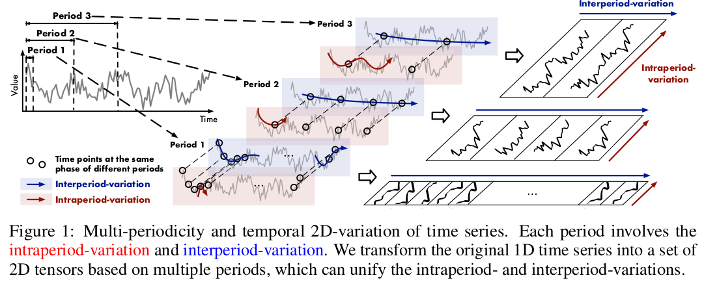
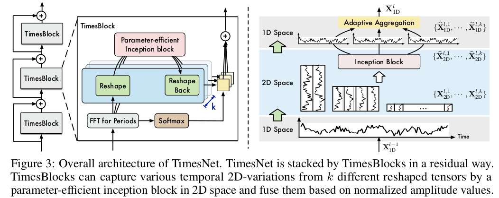

# TimesNet: TEMPORAL 2D-VARIATION MODELING FOR GENERAL TIME SERIES ANALYSIS

- Paper Link: [ICLR 2023](https://openreview.net/pdf?id=ju_Uqw384Oq)
- GithubCode: [https://github.com/thuml/Time-Series-Library/blob/main/models/TimesNet.py](https://github.com/thuml/Time-Series-Library/blob/main/models/TimesNet.py)

## 1- Summary
Previous methods:
- attempt to accomplish this directly from the 1D time series.(extremely challenging)

TimesNet:
- complex temporal variations of multi-periodicty intraperiod- and interperiod-variations.
- extend 1D -> 2D - based on multiple periods
    - TimesBlock as a task-general backbone for time series analysis.

SOTA: in five mainstream time
- short- and long-term forcasting
- imputation
- classification
- anomaly detection

## 2- Introduction

Analyze:
- 1st. real-word time serires usually present multi-periodicity, such as daily and yearly variations for weather observations, weekly and quarterly variations for electricity consumption
- 2ed. variation of each time point is not only affected by the temporal pattern of its adjacent area(intraperiod-variation) but alse high related to the variation of its adjacent periods(interperiod-variation).
- for the time series without clear periodcity, the variations will be dominated by the intraperiod-varation and is 
    equivalent to the ones with infinite period length.

Contributions:
- 1st. Motivated by multi-periodicity and complex interactions within and between periods, we find out a modular way for temporal variation modeling.
    - Thinking: it not conside the influence of specific human factor.
- 2ed. propose the TimesNet with TimesBlock to discover multiple periods and capture temporal 2D-variations from the transformed 2D tensors by a parameter-efficient inception block.
- 3rd. Achieve the consistent SOTA in five mainstream time series analysis tasks. Detailed and insightful visualizations are included.

## 3- TimesNet
### 3.1 Transform 1D-variations into 2D-variations

each time point involves two types of temporal variations with its adjacent area and with the same phase among different periods simultaneously, namely intraperiod- and interperiod- variations.

the original 1D structure of time series can only present the variations among adjacent time points.
To tackle this limitation, we explore the two-dimension structure for temporal variations, which can explicitly present variations within and between periods, thereby with more advantages in representation capability and benefiting the subsequent representation learning.

$X_{1D} \in \mathcal{R}^{T \times C}$, discover periods first. We analyze the time series in the frequency domain by FFT. 
$$\bf{A} = Avg(Amp(FFT(X_{1D}))), \{f_1, f_2, ..., f_k\}=\underset{f_* \in \{1, ..., \lceil \frac{T}{2}\rceil\}}{arg\ Topk} (A), p_i = \lceil \frac{T}{f_i}\rceil, i \in \{1, .., k\} \space(2) (1)$$

summarize Equation 1 as follows:
$$A, \{f_1, ..., f_k\}, \{p_1, ..., p_k\}=Period(X_{1D}) \ \ \ (2)$$
- $f_i$ : frequence
- $p_i = \lceil \frac{T}{f_i}\rceil$: period length 

reshape the 1D time series $X_{1D} \in \mathcal{R}^{T \times C}$ into multiple 2D tensors by the following equations:
$$X^{i}_{2D} = Reshape_{p_i, f_i}(Padding(X_{1D})), i \in \{1, ..., k\}$$

- $Padding(\cdot)$ is to extend the time series by zeros along temporal dimension to make it compatible for $Reshape_{p_i, f_i}(\cdot)$
    - row: $p_i$
    - column: $f_i$
- $X^{i}_{2D} \in \mathcal{R}^{T\times C}$ denotes the i-th reshaped time serires base on frequency-$f_i$
- obtain a set of 2D tensor $\{ X^{1}_{2D}, ..., X^{k}_{2D}  \}$

It is also notable that, this transformation brings two types of localities to the transformed 2D tensors, that is localities among adjacent time points(column, intraperiod-variation) and adjacent periods(rows, interperiod-variation). Thus, the temporal 2D-variations can be easily processed by 2D kernels.

### 3.2 TimesBlock

organized the TimesBlock in residual way.

$X_{1D}^0 = Embed(X_{1D}),\ \ X_{1D}^0 \in \mathcal{R}^{T\times d_{model}}$ -->   
$X^{l}_{1D} = TimesBlock(X^{l-1}_{1D}) +X^{l-1}_{1D}, \ \ X^{l}_{1D} \in \mathcal{R}^{T\times d_{model}}$

the whole process involves two successive parts:
1. capturing temporal 2D-variations 
   1. Similar to Equation 1. transform the 1D time series into 2D space and obtain a set of 2D tensors
    - $A^{l-1},\{f_1,...,f_k\},\{p_1, ..., p_k\}=Period(X^{l-1}_{1D})$
    - $X_{2D}^{l, i}=Reshape_{p_i, f_i}(Padding(X^{l-1}_{1D})), i\in \{1, ..., k\}$  
    - $\hat{X}_{2D}^{l, i}=Inception(X^{l, i}_{2D}), i\in \{1, ..., k\}$   
    - $\hat{X}_{1D}^{l, i}=Trunc(Reshape_{1, p_i\times f_i}(\hat{X}_{2D}^{l, i})),  i\in \{1, ..., k\}$  
        - $X_{2D}^{l, i} \in \mathcal{R}^{p_i \times f_i \times d_{model}}$ 
        - the 2D kernel

2. adaptively aggregating representations
    - fuse k different 1D-representations $\{\hat{X}_{1D}^{l, 1}, ..., \hat{X}_{1D}^{l, k}\}$ for next layer
    - Inspired by Auto-Correlation(2021), **the amplitudes A can reflect the relative importance of selected frequencies and periods.**
        - $\hat{A}_{f_1}^{l-1}, ..., \hat{A}_{f_k}^{l-1}=Softmax(A_{f_1}^{l-1}, ..., A_{f_k}^{l-1})$
        - $X_{1D}^l = \sum_{i=1}^{k}\hat{A}_{f_i}^{l-1} \times \hat{X}_{1D}^{l, i}$

3. Generality in 2D vision backbones
    - 2D backbones for representation learning will bring better performance
    - we conduct the main experiments based on the parameter-efficient inception block as shown in Equation 5 (Inception)

## 4- Experiments

1. SHORT- AND LONG-TERM FORECASTING
    - TimesNet shows great performance in both long-term and short-term settings Concretely, TimesNet achieves state-of-the-art in more than 80% of cases in long-term forecasting.

## 5- Conclusion and Future Work

This paper presents the TimesNet as a task-general foundation model for time series analysis. Motivated
by the multi-periodicity, TimesNet can ravel out intricate temporal variations by a modular
architecture and capture intraperiod- and interperiod-variations in 2D space by a parameter-efficient
inception block.

Future Work:
- explore large-scale pre-training methods in time series
    - TimesNet as the backbone and can generally benefit extensive downstream tasks.